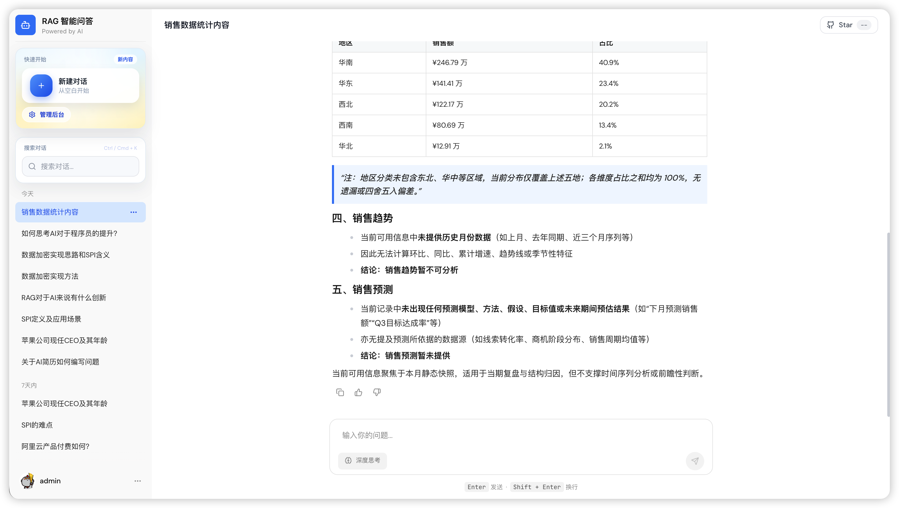
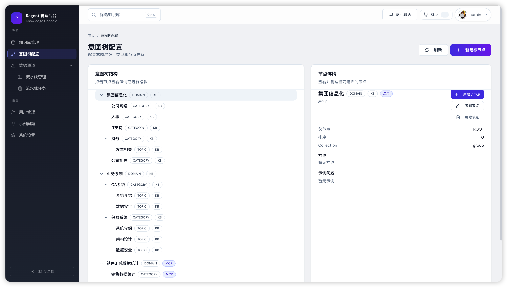
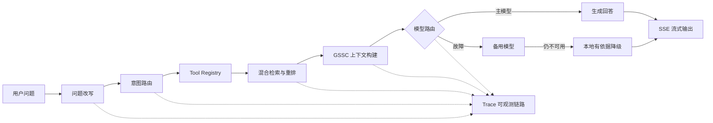

# AI Product Assistant RAG

> 面向产品、销售、售前和客户成功团队的 Python Agentic RAG 产品智能助手。

[](python-backend)
[](python-backend)
[](frontend)
[](https://github.com/ssafdo/ai-product-assistant-rag/actions/workflows/ci.yml)
[](LICENSE)

这不是一个只封装大模型接口的聊天 Demo。项目实现了从文档入库、问题改写、意图路由、多路检索、上下文构建、模型生成到 SSE 流式回答和链路追踪的完整闭环，并提供知识库、意图树、术语映射、用户和 Trace 管理后台。

Python 后端默认使用 SQLite，可在不安装 PostgreSQL、Redis、消息队列和向量数据库的情况下完成端到端演示；配置 OpenAI 兼容模型后即可切换为完整的生成式回答。

## 界面预览

| 智能问答 | 管理后台 |
| --- | --- |
|  |  |

## 核心链路



一次问答会记录以下可观测节点：

1. `Rewrite`：结合术语映射和最近会话解决指代与表达差异。
2. `Intent Routing`：识别产品介绍、套餐价格、交付部署、售前支持和版本发布等意图。
3. `Tool / Retrieval`：Agent 通过工具注册中心调用知识检索，并执行意图定向重排。
4. `Context Engineering`：采用 Gather、Select、Structure、Compress 组织证据与短期记忆。
5. `Generation`：主备模型容错，模型不可用时返回带引用的本地有依据回答。

## 项目亮点

- **Agentic RAG**：将知识检索和业务查询统一抽象为工具，通过受控 Agent 编排完成检索增强生成。
- **可解释回答**：回答使用 `[资料N]` 标注依据，并返回命中文档、分块内容、分数和检索通道。
- **模型路由与降级**：支持两个 OpenAI 兼容模型顺序容错；无 API Key 时仍能完整运行和演示。
- **上下文工程**：多轮历史、问题改写、意图提示和检索证据均受字符预算约束，避免上下文无限膨胀。
- **知识治理**：支持文档上传、结构感知切分、分块编辑、启停、重建、入库日志和流水线管理。
- **端到端可观测性**：记录会话、任务、耗时、状态与 5 类核心节点，便于定位召回和生成问题。
- **前后端完整产品**：React 管理台兼容 70+ 个 FastAPI 接口，包含认证、聊天、知识库和运营看板。

## 技术栈

| 模块 | 技术 |
| --- | --- |
| Python 后端 | Python 3.11+、FastAPI、SQLite、httpx、Pydantic |
| Agent / RAG | Tool Registry、Intent Routing、Hybrid Retrieval、GSSC Context、Model Router |
| 前端 | React 18、TypeScript、Vite、Tailwind CSS、Zustand、Recharts |
| 文档处理 | Markdown / TXT、PDF、DOCX、结构感知切分 |
| 接口与流式输出 | REST、SSE、OpenAI-compatible API |
| 工程化 | Pytest、Vite Build、GitHub Actions |

## 快速启动

### 1. 启动 Python 后端

```bash
cd python-backend
python -m venv .venv

# Windows
.venv\Scripts\pip install -r requirements.txt
.venv\Scripts\python run.py

# macOS / Linux
.venv/bin/pip install -r requirements.txt
.venv/bin/python run.py
```

首次启动会自动创建 SQLite 数据库并导入 6 份产品知识样例。后端地址为 `http://localhost:9090`，Swagger 文档位于 `http://localhost:9090/docs`。

### 2. 启动前端

```bash
cd frontend
npm install
npm run dev
```

访问 `http://localhost:5173`，演示管理员账号为 `admin / admin`。

### 3. 接入大模型（可选）

复制 `python-backend/.env.example` 为 `python-backend/.env`：

```dotenv
LLM_API_KEY=your-api-key
LLM_BASE_URL=https://api.deepseek.com/v1
LLM_MODEL=deepseek-chat
```

适用于 DeepSeek、通义千问、SiliconFlow 和其他 OpenAI 兼容服务。不配置 Key 时自动使用本地有依据降级回答。

## 项目结构

```text
.
├── python-backend/         # 推荐后端：FastAPI、Agent、RAG、SQLite、Trace
│   ├── app/
│   │   ├── main.py         # 认证、知识库、聊天、管理台等 API
│   │   ├── rag.py          # Agent 编排、检索、上下文与模型路由
│   │   ├── database.py     # SQLite Schema、认证与种子数据
│   │   └── config.py       # 环境配置
│   └── tests/              # Python 单元测试
├── frontend/               # React 用户问答页与管理后台
├── resources/docs/         # 可直接入库的产品知识样例
├── bootstrap/              # 原 Spring Boot 实现，保留作架构对照
├── framework/              # Java 通用基础设施
└── infra-ai/               # Java 模型、Embedding 与路由实现
```

## 验证

```bash
cd python-backend
.venv/Scripts/python -m pytest -q   # Windows

cd ../frontend
npm run build
```

本地验证覆盖 Python 编译与测试、前端生产构建，以及“登录 → RAG SSE → 会话持久化 → Trace 查询”的端到端链路。

## 进一步演进

- 将本地混合召回替换为 BM25 + 向量检索，并增加离线 Recall@K / MRR 评测集。
- 引入 Redis 会话缓存和任务队列，支持大文件异步入库与并发限流。
- 增加 MCP / Function Calling 业务工具，让 Agent 查询订单、配置和任务状态。
- 使用 Docker Compose 提供 PostgreSQL + pgvector 的生产化部署方案。

## 项目说明

本仓库的 Python Agentic RAG 后端、产品场景改造和前端接口适配为本项目实现内容；Java 模块基于开源项目 [nageoffer/ragent](https://github.com/nageoffer/ragent) 的工程结构演进并保留作架构对照。仓库遵循原项目的 Apache License 2.0。

## License

[Apache License 2.0](LICENSE)
