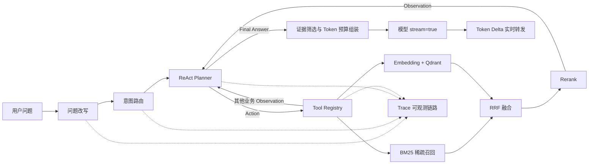

# AI Product Assistant RAG

> 面向产品、销售、售前和客户成功团队的 Python Agentic RAG 产品智能助手。

[](python-backend)
[](python-backend)
[](frontend)
[](https://github.com/ssafdo/ai-product-assistant-rag/actions/workflows/ci.yml)
[](LICENSE)

这不是一个只封装大模型接口的聊天 Demo。项目实现了从文档入库、Embedding、BM25 + 向量混合召回、Rerank 到多轮 ReAct 工具调用、模型 Token 流式回答和链路追踪的完整闭环，并提供知识库、意图树、术语映射、用户和 Trace 管理后台。

Python 后端使用 SQLite 保存业务数据，Qdrant Local Mode 持久化向量；默认的确定性 Embedding、Rerank 和 ReAct Planner 可离线演示，配置兼容 API 后即可切换为真实 Embedding、Rerank 与大模型 Function Calling。

## 界面预览

| 智能问答 | 管理后台 |
| --- | --- |
|  |  |

## 核心链路



一次问答会记录以下可观测节点：

1. `Rewrite`：结合术语映射和最近会话解决指代与表达差异。
2. `Intent Routing`：识别产品介绍、套餐价格、交付部署、售前支持和版本发布等意图。
3. `Plan / Action`：模型读取工具 JSON Schema，自主选择工具及参数。
4. `Observation`：执行工具并将结构化结果以 `role=tool` 回填，模型据此继续规划。
5. `Retrieval`：BM25 与 Qdrant 向量双路召回，RRF 融合后由 Rerank 模型重排。
6. `Generation`：在最大步数保护内结束循环；模型不可用时返回带引用的本地有依据回答。

## 项目亮点

- **真实 ReAct 工具循环**：不是固定工作流伪装成 Agent；模型通过 Function Calling 自主选择工具，支持多轮 Action / Observation、继续规划、工具异常回填和最大步数保护。
- **四阶段混合检索**：标准 BM25 稀疏召回与 Qdrant 向量召回并行，经 RRF 消除分数量纲差异，再使用独立 Rerank 模型重排。
- **可插拔模型能力**：Embedding 和 Rerank 均支持独立兼容 API；未配置 Key 时使用确定性本地实现，确保仓库可直接运行。
- **可解释回答**：回答使用 `[资料N]` 标注依据，并返回 BM25、向量、Rerank 三阶段分数和检索通道。
- **真实 Token 流**：最终模型请求启用 `stream=true`，后端解析上游 `delta.content` 并原样转发为 SSE，不对完整答案进行字符串切片伪流式处理。
- **Token 预算上下文**：按相关度筛选并去重证据，将问题、意图、证据、工具 Observation 和最近对话分区组装，通过 `tiktoken` 精确计数并按优先级截断。
- **模型路由与降级**：支持两个 OpenAI 兼容模型顺序容错；无 API Key 时仍能完整运行和演示。
- **知识治理**：支持文档上传、结构感知切分、分块编辑、启停、重建、入库日志和流水线管理。
- **端到端可观测性**：逐轮记录 Plan、Action、Observation、模型路由、耗时和结果，便于定位工具选择与召回问题。
- **前后端完整产品**：React 管理台兼容 70+ 个 FastAPI 接口，包含认证、聊天、知识库和运营看板。

## 技术栈

| 模块 | 技术 |
| --- | --- |
| Python 后端 | Python 3.11+、FastAPI、SQLite、httpx、Pydantic |
| Agent / RAG | ReAct、OpenAI Function Calling、Tool Registry、BM25、RRF、Rerank、Token Budget |
| Embedding / Vector DB | OpenAI-compatible Embeddings、Qdrant Local Mode |
| 前端 | React 18、TypeScript、Vite、Tailwind CSS、Zustand、Recharts |
| 文档处理 | Markdown / TXT、PDF、DOCX、结构感知切分 |
| 接口与流式输出 | REST、SSE、OpenAI-compatible Token Streaming |
| 工程化 | Pytest、Vite Build、GitHub Actions |

## 快速启动

### 1. 启动 Python 后端

```bash
cd python-backend
python -m venv .venv

# Windows
.venv\Scripts\pip install -r requirements.txt
.venv\Scripts\python run.py

# macOS / Linux
.venv/bin/pip install -r requirements.txt
.venv/bin/python run.py
```

首次启动会自动创建 SQLite 数据库并导入 6 份产品知识样例。后端地址为 `http://localhost:9090`，Swagger 文档位于 `http://localhost:9090/docs`。

### 2. 启动前端

```bash
cd frontend
npm install
npm run dev
```

访问 `http://localhost:5173`，演示管理员账号为 `admin / admin`。

### 3. 接入大模型（可选）

复制 `python-backend/.env.example` 为 `python-backend/.env`：

```dotenv
LLM_API_KEY=your-api-key
LLM_BASE_URL=https://api.deepseek.com/v1
LLM_MODEL=deepseek-chat

# 可选：真实 Embedding 与 Rerank 服务
EMBEDDING_API_KEY=your-api-key
EMBEDDING_BASE_URL=https://api.openai.com/v1
EMBEDDING_MODEL=text-embedding-3-small
RERANK_API_KEY=your-api-key
RERANK_URL=https://api.siliconflow.cn/v1/rerank
RERANK_MODEL=BAAI/bge-reranker-v2-m3
CONTEXT_TOKEN_BUDGET=6000
MAX_OUTPUT_TOKENS=1200
```

适用于 DeepSeek、通义千问、SiliconFlow 和其他 OpenAI 兼容服务。不配置 Key 时自动使用本地有依据降级回答。

## 项目结构

```text
.
├── python-backend/         # 推荐后端：FastAPI、Agent、RAG、SQLite、Trace
│   ├── app/
│   │   ├── main.py         # 认证、知识库、聊天、管理台等 API
│   │   ├── rag.py          # 产品 Agent 编排、工具与 Trace
│   │   ├── react_agent.py  # Tool Registry、Function Calling 与 ReAct 循环
│   │   ├── retrieval.py    # Embedding、Qdrant、BM25、RRF 与 Rerank
│   │   ├── context_engineering.py # 证据筛选、结构化组装与 Token 预算
│   │   ├── database.py     # SQLite Schema、认证与种子数据
│   │   └── config.py       # 环境配置
│   └── tests/              # Python 单元测试
├── frontend/               # React 用户问答页与管理后台
├── resources/docs/         # 可直接入库的产品知识样例
├── bootstrap/              # 原 Spring Boot 实现，保留作架构对照
├── framework/              # Java 通用基础设施
└── infra-ai/               # Java 模型、Embedding 与路由实现
```

## 验证

```bash
cd python-backend
.venv/Scripts/python -m pytest -q   # Windows

cd ../frontend
npm run build
```

本地验证覆盖 Python 编译与测试、前端生产构建，以及“登录 → RAG SSE → 会话持久化 → Trace 查询”的端到端链路。

## 进一步演进

- 增加离线 Recall@K、MRR、NDCG 评测集和检索参数自动调优。
- 引入 Redis 会话缓存和任务队列，支持大文件异步入库与并发限流。
- 增加 MCP 业务工具，让 Agent 查询订单、客户配置和服务健康状态。
- 使用 Docker Compose 提供 PostgreSQL + pgvector 的生产化部署方案。

## 项目说明

本仓库的 Python Agentic RAG 后端、产品场景改造和前端接口适配为本项目实现内容；Java 模块基于开源项目 [nageoffer/ragent](https://github.com/nageoffer/ragent) 的工程结构演进并保留作架构对照。仓库遵循原项目的 Apache License 2.0。

## License

[Apache License 2.0](LICENSE)
